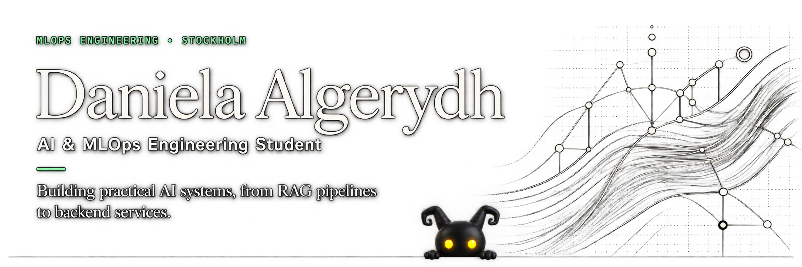

  

- Stockholm, Sweden
- Currently looking for my **LIA internship (Spring 2027)**

---

I enjoy building AI systems that solve real-world problems.

During my studies I've focused on combining **backend engineering**, **Retrieval-Augmented Generation (RAG)**, **LLMOps**, and **MLOps** to build production-inspired AI applications.

I'm particularly interested in designing complete AI systems from document ingestion and APIs to evaluation, deployment and monitoring.

---

## Technologies

### Languages

### AI & LLM

### Backend & MLOps

---

# Featured Projects

## Wired-AI

**AI onboarding copilot for interns and junior engineers**

A production-inspired AI assistant that combines Retrieval-Augmented Generation, mentor-style guidance and escalation support for a fictional engineering organization.

### Highlights

- RAG with LanceDB
- FastAPI backend
- Streamlit frontend
- MLflow prompt versioning & evaluation
- Dockerized architecture
- Azure deployment

Repository: https://github.com/omeraytug/Wired-AI

---

### Taxi Price Prediction

End-to-end machine learning workflow for predicting taxi prices from historical trip data.

---

### MLOps Model Serving

Production-inspired model serving using FastAPI and modern MLOps practices.

---

### PyTorch Training Pipeline

Training pipeline built with PyTorch as part of my machine learning studies.

---

# Currently Learning

- Production-ready AI systems
- Multi-agent architectures
- LLMOps
- CI/CD for Machine Learning
- Cloud-native AI applications

---

# Current Goal

I'm looking for a LIA where I can contribute to real AI products while continuing to grow within:

- AI Engineering
- MLOps
- LLMOps
- Backend Development

---

# Let's Connect

LinkedIn  
https://www.linkedin.com/in/daniela-algerydh

Stockholm, Sweden

---
